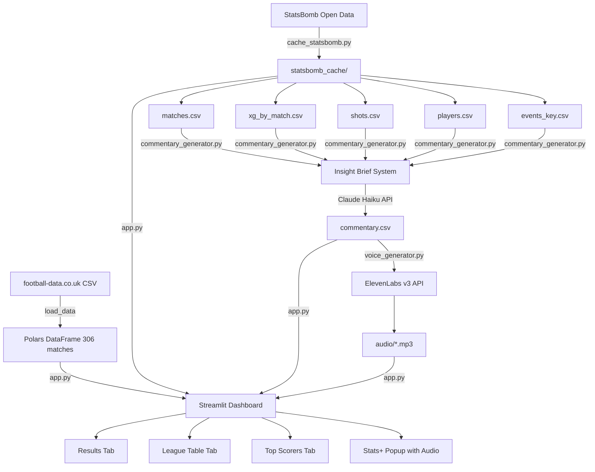

# ⚽ Bundesliga 2023/24 — Leverkusen Invincibles Dashboard

> A complete data pipeline from raw CSV to AI-voiced football commentary — built with Python, StatsBomb, Claude AI and ElevenLabs.

**Live app:** [leverkusen-unbeaten-app.streamlit.app](https://leverkusen-unbeaten-app.streamlit.app)  
**GitHub:** [github.com/deano888/leverkusen-unbeaten-app](https://github.com/deano888/leverkusen-unbeaten-app)

---

## 📋 Table of Contents

1. [Project Overview](#1-project-overview)
2. [Architecture Diagram](#2-architecture-diagram)
3. [Environment Setup](#3-environment-setup)
4. [Project Structure](#4-project-structure)
5. [Data Pipeline](#5-data-pipeline)
6. [Key Python Patterns](#6-key-python-patterns)
7. [API Integrations](#7-api-integrations)
8. [Streamlit App Structure](#8-streamlit-app-structure)
9. [Commentary Generation System](#9-commentary-generation-system)
10. [Voice Synthesis Pipeline](#10-voice-synthesis-pipeline)
11. [Deployment](#11-deployment)
12. [Reference: Data Schemas](#12-reference-data-schemas)

---

## 1. Project Overview

This app brings Bayer Leverkusen's historic 2023/24 unbeaten Bundesliga season to life with:

| Feature | Technology |
|---|---|
| Match results, odds, league table | football-data.co.uk CSV |
| xG, shot maps, player stats | StatsBomb Open Data |
| AI-generated match commentary | Anthropic Claude API |
| Voice narration with emotion tags | ElevenLabs v3 TTS |
| Interactive dashboard | Streamlit |
| Deployment + audio hosting | Streamlit Community Cloud + GitHub LFS |

**The core innovation:** A structured "insight brief" system that computes 25+ contextual flags from data *before* calling the AI — so Claude writes from facts, not assumptions. This eliminates hallucination entirely.

---

## 2. Architecture Diagram



---

## 3. Environment Setup

### Prerequisites
- Python 3.9+
- Git + Git LFS (for audio files)

### Step by step

```bash
# 1. Clone
git clone https://github.com/deano888/leverkusen-unbeaten-app.git
cd leverkusen-unbeaten-app

# 2. Create virtual environment
py -m venv .venv

# 3. Activate (Windows PowerShell)
.\.venv\Scripts\Activate.ps1
# If blocked: Set-ExecutionPolicy RemoteSigned -Scope CurrentUser

# 4. Install
pip install streamlit pandas polars requests statsbombpy

# 5. Build StatsBomb cache (once, ~5 minutes)
py cache_statsbomb.py

# 6. Build league tables (once, ~30 seconds)
py build_tables.py

# 7. Generate commentary (requires Anthropic API key)
py commentary_generator.py

# 8. Generate voice (requires ElevenLabs API key)
py voice_generator.py

# 9. Run
streamlit run app.py
```

### API Keys

Scripts prompt interactively — or set as environment variables:

```bash
$env:ANTHROPIC_API_KEY  = "sk-ant-..."
$env:ELEVENLABS_API_KEY = "..."
```

---

## 4. Project Structure

```
leverkusen_unbeaten_app/
├── app.py                      # Main Streamlit app (~1,300 lines)
├── data_loader.py              # Loads football-data.co.uk CSV (Polars)
├── xg_loader.py                # StatsBomb xG, players, key events
├── shot_loader.py              # Shot sequences for highlights
├── voice_loader.py             # MP3 playback + duration reading
├── commentary_loader.py        # Loads commentary.csv
├── badges.py                   # SVG team badge circles
├── player_nationalities.py     # Player nationalities + goal cries
├── cache_statsbomb.py          # ONE-TIME: download StatsBomb data
├── build_tables.py             # ONE-TIME: pre-calculate league tables
├── commentary_generator.py     # Generate commentary via Claude API
├── voice_generator.py          # Generate MP3s via ElevenLabs API
├── review_commentary.py        # QA: review commentary match by match
├── requirements.txt
├── .gitignore                  # Excludes .venv/
├── .gitattributes              # Git LFS: *.mp3
├── .streamlit/config.toml      # Dark theme
└── statsbomb_cache/
    ├── matches.csv
    ├── xg_by_match.csv
    ├── shots.csv
    ├── players.csv
    ├── events_key.csv
    ├── commentary.csv
    ├── league_tables.json
    ├── top_scorers.json
    └── audio/*.mp3
```

---

## 5. Data Pipeline

### 5.1 football-data.co.uk

```python
# data_loader.py
import polars as pl

KEEP_COLS = ["Date","HomeTeam","AwayTeam","FTHG","FTAG",
             "HTHG","HTAG","B365H","B365D","B365A"]

def load_data() -> pl.DataFrame:
    url = "https://www.football-data.co.uk/mmz4281/2324/D1.csv"
    df  = pl.read_csv(url, ignore_errors=True).select(KEEP_COLS)
    df  = df.with_columns(
        pl.col("Date").str.strptime(pl.Date, format="%d/%m/%Y", strict=False)
    ).sort("Date")
    # 306 matches / 9 per round = 34 rounds
    df = df.with_row_index("_row_idx").with_columns(
        ((pl.col("_row_idx") // 9) + 1).cast(pl.Int32).alias("Round")
    ).drop("_row_idx")
    return df
```

**Sample output:**

| Date | HomeTeam | AwayTeam | FTHG | FTAG | B365H | B365D | B365A | Round |
|------|----------|----------|------|------|-------|-------|-------|-------|
| 2024-05-18 | Leverkusen | Augsburg | 2 | 1 | 1.30 | 6.65 | 7.63 | 34 |

### 5.2 StatsBomb Event Data

```python
# cache_statsbomb.py
from statsbombpy import sb
import pandas as pd

matches  = sb.matches(competition_id=9, season_id=281)
lev_games = matches[
    (matches["home_team"]=="Bayer Leverkusen") |
    (matches["away_team"]=="Bayer Leverkusen")
]

all_shots = []
for _, match in lev_games.iterrows():
    events = sb.events(match_id=match["match_id"])
    shots  = events[events["type"].apply(
        lambda x: x.get("name","") if isinstance(x,dict) else str(x)
    ) == "Shot"]
    all_shots.append(shots)

pd.concat(all_shots).to_csv("statsbomb_cache/shots.csv", index=False)
```

**Extracting nested StatsBomb dicts:**

```python
def get_name(val):
    if isinstance(val, dict): return val.get("name","")
    return str(val) if pd.notna(val) else ""

shot_type  = get_name(event["shot_type"])      # "Open Play", "Corner", "Free Kick"
technique  = get_name(event["shot_technique"]) # "Normal", "Volley", "Header"
body_part  = get_name(event["shot_body_part"]) # "Right Foot", "Head"
```

### 5.3 Shot Coordinate System

```
StatsBomb pitch:  x=0 (own goal) → x=120 (opponent goal), y=0 → y=80
SVG half-pitch:   x=0 (halfway)  → x=560 (goal line),     y=0 → y=320

IMPORTANT: StatsBomb always stores x from the SHOOTING team's perspective.
No home/away flip needed — x=120 is always "towards goal".
```

```python
def statsbomb_to_svg(sb_x, sb_y):
    nx = (sb_x - 60) / 60 * 560   # attacking half only
    ny = sb_y / 80 * 320
    return nx, ny

# Key pitch landmarks (SVG pixels)
PENALTY_BOX_LEFT = 406   # 16.5m from goal
PENALTY_SPOT_X   = 457   # 11m from goal
SIX_YARD_LEFT    = 504   # 5.5m from goal
```

**Penalty arc SVG path:**
```
M 406 92 A 85 85 0 0 0 406 228
│         │ │  │ │ │ └─ end point (intersects box bottom)
│         │ │  │ │ └─── sweep=0 (anticlockwise = curves LEFT = outside box)
│         │ │  │ └───── large-arc=0
│         │ │  └─────── x-rotation=0
│         └─┴────────── radius 85px (9.15m scaled)
└─────────────────────── start point (intersects box top)
```

### 5.4 League Table Pre-calculation

```python
# build_tables.py — compute once, load instantly
import json, polars as pl
from data_loader import load_data

def build_all_tables():
    df = load_data()
    league_tables = {}

    for md in range(1, 35):
        cumulative = df.filter(pl.col("Round") <= md)
        table = {}

        for row in cumulative.iter_rows(named=True):
            home, away = row["HomeTeam"], row["AwayTeam"]
            hg,   ag   = int(row["FTHG"]),  int(row["FTAG"])

            for team in [home, away]:
                if team not in table:
                    table[team] = {"played":0,"won":0,"drawn":0,
                                   "lost":0,"gf":0,"ga":0}

            table[home]["gf"] += hg; table[home]["ga"] += ag
            table[away]["gf"] += ag; table[away]["ga"] += hg
            table[home]["played"] += 1; table[away]["played"] += 1

            if hg > ag:
                table[home]["won"]  += 1; table[away]["lost"]  += 1
            elif ag > hg:
                table[away]["won"]  += 1; table[home]["lost"]  += 1
            else:
                table[home]["drawn"] += 1; table[away]["drawn"] += 1

        rows = list(table.values())
        for r in rows:
            r["gd"]  = r["gf"] - r["ga"]
            r["pts"] = r["won"]*3 + r["drawn"]
        rows.sort(key=lambda x: (-x["pts"], -x["gd"], -x["gf"]))
        league_tables[str(md)] = rows

    with open("statsbomb_cache/league_tables.json","w") as f:
        json.dump(league_tables, f)
```

> **Pattern:** Compute once at build time → save as JSON → load with `@st.cache_data`. Applies to any heavy computation that doesn't change between sessions.

---

## 6. Key Python Patterns

### 6.1 Polars vs Pandas

| Task | Polars | Pandas |
|------|--------|--------|
| Read CSV | `pl.read_csv(path)` | `pd.read_csv(path)` |
| Filter | `df.filter(pl.col("Round") == 34)` | `df[df["Round"]==34]` |
| Select cols | `df.select(["A","B"])` | `df[["A","B"]]` |
| Add column | `df.with_columns(pl.lit(1).alias("x"))` | `df["x"] = 1` |
| Group by | `df.group_by("team").agg(pl.sum("goals"))` | `df.groupby("team")["goals"].sum()` |
| Iterate rows | `for row in df.iter_rows(named=True):` | `for _,row in df.iterrows():` |
| Sort | `df.sort("pts", descending=True)` | `df.sort_values("pts",ascending=False)` |
| Unique list | `df["Round"].unique().to_list()` | `df["Round"].unique().tolist()` |

### 6.2 Streamlit Caching

```python
@st.cache_data           # Serialises data — safe for DataFrames, dicts, lists
def load_data():         # Recomputes if function signature changes
    return pl.read_csv(...)

@st.cache_data(ttl=3600) # Expire cache after 1 hour
def load_live_data():
    ...

@st.cache_resource       # Caches object reference — use for connections/models
def get_model():
    return load_ml_model()
```

### 6.3 Session State

```python
# Initialise with default
if "view_tab" not in st.session_state:
    st.session_state.view_tab = "results"

# Read
tab = st.session_state.view_tab

# Write + trigger rerun
st.session_state.view_tab = "league"
st.rerun()

# Detect change (audio kill on matchday change)
if st.session_state.get("_prev_md") != selected:
    st.session_state["stop_audio"] = True
st.session_state["_prev_md"] = selected
```

### 6.4 Ordinal Minutes for TTS

```python
def ordinal(n):
    """1->'1st', 11->'11th', 92->'92nd'. ElevenLabs reads these naturally."""
    n = int(n)
    if 11 <= (n % 100) <= 13:    # 11th/12th/13th — NOT 11st/12nd/13rd
        return f"{n}th"
    return f"{n}{['th','st','nd','rd','th','th','th','th','th','th'][n%10]}"
```

### 6.5 Score to Words for TTS

```python
def score_to_words(text):
    """'2-1' -> 'two-one', '3-0' -> 'three-nil', '1-1' -> 'one all'
    ElevenLabs reads '2-1' with a pause on the hyphen. Words flow naturally."""
    import re
    nums = {"0":"nil","1":"one","2":"two","3":"three","4":"four",
            "5":"five","6":"six","7":"seven","8":"eight","9":"nine"}
    def replace(m):
        hw = nums.get(m.group(1), m.group(1))
        aw = nums.get(m.group(2), m.group(2))
        return f"{hw} all" if m.group(1)==m.group(2) else f"{hw}-{aw}"
    return re.sub(r"\b([0-9])-([0-9])\b", replace, text)
```

### 6.6 SVG Inline Rendering

```python
# Build SVG string
svg = f'''<svg viewBox="0 0 560 320" xmlns="http://www.w3.org/2000/svg">
    <rect width="560" height="320" fill="#2d6a3f"/>
    <rect x="406" y="79" width="154" height="162"
          fill="rgba(0,0,0,0.12)" stroke="rgba(255,255,255,0.5)" stroke-width="1.5"/>
    <path d="M 406 92 A 85 85 0 0 0 406 228"
          fill="none" stroke="rgba(255,255,255,0.35)" stroke-width="1.5"/>
    <circle cx="{nx:.0f}" cy="{ny:.0f}" r="8"
            fill="{'#d20515' if is_goal else '#888899'}"
            stroke="white" stroke-width="2"/>
</svg>'''

# Render — must use unsafe_allow_html=True
st.markdown(f'<div class="card">{svg}</div>', unsafe_allow_html=True)
```

---

## 7. API Integrations

### 7.1 Anthropic Claude API

**Why:** Natural language generation from structured data. Claude Haiku (cheapest/fastest) is adequate.

**Cost:** ~$0.001 per 1,000 input tokens. Full 10-match commentary generation ≈ $0.02–0.05 total.

```python
API_URL = "https://api.anthropic.com/v1/messages"
MODEL   = "claude-haiku-4-5-20251001"

def call_claude(prompt, max_tokens=120):
    resp = requests.post(
        API_URL,
        headers={
            "Content-Type":    "application/json",
            "x-api-key":       _API_KEY,
            "anthropic-version": "2023-06-01",  # Required
        },
        json={
            "model":    MODEL,
            "max_tokens": max_tokens,
            "messages": [{"role":"user","content": prompt}]
        }
    )
    if resp.status_code == 200:
        return resp.json()["content"][0]["text"].strip()
    return ""
```

**The insight brief system — prevents hallucination:**

```python
# Never pass raw data to Claude.
# Always compute significance flags FIRST, then pass the brief.

def build_highlight_brief(shot, match_brief, player_goal_num=1):
    # Layer 1: Facts
    player = shot["player"]; minute = shot["minute"]
    xg     = float(shot["xg"]); is_goal = shot["is_goal"] == 1
    team   = shot["team_fd"]

    # Layer 2: Significance (human logic — NOT AI)
    is_lev = team == "Leverkusen"
    h_s, a_s  = map(int, shot["score_after"].split("-"))
    lev_score = h_s if match_brief["lev_home"] else a_s
    opp_score = a_s if match_brief["lev_home"] else h_s

    return {
        "is_opener":         is_goal and is_lev and lev_score==1 and opp_score==0,
        "is_go_ahead":       is_goal and is_lev and lev_score == opp_score+1,
        "is_consolation":    is_goal and not is_lev and opp_score < lev_score,
        "is_screamer":       is_goal and xg < 0.05,
        "hattrick_complete": (player in match_brief.get("hattrick",[])
                              and player_goal_num == 3),
        "brace":             (player in match_brief.get("brace_scorer",[])
                              and player not in match_brief.get("hattrick",[])
                              and player_goal_num == 2),
        # ...25+ more flags
    }

# Layer 3: Claude writes from the brief — never from raw numbers
text = generate_highlight(brief, match_brief, brief_str)
```

### 7.2 ElevenLabs API

**Why:** Natural speech with emotional direction. REST API used directly (no SDK) to avoid Windows long path issues.

**v3 vs v1:** v3 supports inline audio tags (`[SHOUTING]`, `[warmly]`, `[crowd cheering]`) — turns flat text into a directed performance.

```python
MODEL_ID = "eleven_v3"   # Supports audio tags

def generate_audio(voice_id, text, out_path):
    resp = requests.post(
        f"https://api.elevenlabs.io/v1/text-to-speech/{voice_id}",
        headers={
            "xi-api-key":   get_api_key(),
            "Content-Type": "application/json",
            "Accept":       "audio/mpeg",
        },
        json={
            "text":     text,
            "model_id": MODEL_ID,
            "voice_settings": {
                "stability":        0.35,  # Lower = more expressive
                "similarity_boost": 0.80,
                "style":            0.45,  # Higher = more commentator energy
                "use_speaker_boost": True
            }
        }
    )
    with open(out_path, "wb") as f:
        f.write(resp.content)
```

**Audio tag format:**
```
[calm, building] Eleven minutes in...
[EXCITED] Boniface — through on goal!
[SHOUTING] GOAAAAAL! GOAL-O! Oya! [crowd cheering]
[pause]
[warmly] Clinical. The Nigerian. Always in the right place.
```

**Available tags:** `[calm]` `[building]` `[EXCITED]` `[SHOUTING]` `[warmly]` `[quietly]` `[reverently]` `[pause]` `[gasps]` `[laughs]` `[crowd cheering]`

---

## 8. Streamlit App Structure

### Three-Phase Dialog Sequence

```
Phase 1: Stats animation
  intro audio starts (embedded HTML) + stats animate for intro_duration seconds
  wait = intro_duration + 2.0 seconds total from dialog open

Phase 2: Highlight sequence (for each shot / red card)
  blank flash 0.3s → render card HTML + audio inline → wait audio_duration + 0.3s
  audio stops automatically when card is replaced (element removed from DOM)

Phase 3: Static summary
  all stats + lineups at once
```

### Inline Audio (Why and How)

```python
# Audio embedded INSIDE card HTML — stops when card is replaced
b64 = get_audio_b64(home, away, "highlight", idx)
audio_html = (
    f'<audio autoplay style="display:none;">'
    f'<source src="data:audio/mp3;base64,{b64}" type="audio/mp3">'
    f'</audio>'
)
main_ph.markdown(make_pitch(item, i, total) + audio_html, unsafe_allow_html=True)
# When main_ph.markdown() is called again, the old audio element is destroyed
```

### Killing Audio on Navigation

```python
# Set flag when user navigates away
st.session_state["stop_audio"] = True
st.rerun()

# At top of main() — use components.v1.html for reliable JS execution
if st.session_state.get("stop_audio"):
    import streamlit.components.v1 as stc
    stc.html("""<script>
    var a = window.parent.document.querySelectorAll("audio");
    for(var i=0;i<a.length;i++){a[i].pause();a[i].currentTime=0;}
    </script>""", height=0)
    st.session_state["stop_audio"] = False
```

> **Why `components.v1.html`?** `st.markdown(<script>...)` is stripped by Streamlit's sanitiser. `components.v1.html` renders in an iframe that executes JavaScript reliably, and `window.parent.document` accesses the parent page's DOM.

---

## 9. Commentary Generation System

### Three-Layer NLG Framework

```
Layer 1 — WHAT   : player, minute, score, xG, shot position (raw data)
Layer 2 — SO WHAT: insight flags — human domain logic decides significance
Layer 3 — HOW    : Claude API with emotion direction — AI handles expression only
```

### Multilingual Goal Celebrations

```python
PLAYER_NATIONALITIES = {
    "Florian Wirtz":        {"goal_cry": "TOOOOOR!",     "lang": "German",   "flag": "🇩🇪"},
    "Victor Okoh Boniface": {"goal_cry": "GOAL-O! Oya!", "lang": "Nigerian", "flag": "🇳🇬"},
    "Alejandro Grimaldo":   {"goal_cry": "GOLAZO!",      "lang": "Spanish",  "flag": "🇪🇸"},
    "Granit Xhaka":         {"goal_cry": "TOR! Wunderbar!","lang": "Swiss",  "flag": "🇨🇭"},
    "Jeremie Frimpong":     {"goal_cry": "DOELPUNT!",    "lang": "Dutch",    "flag": "🇳🇱"},
}
```

---

## 10. Voice Synthesis Pipeline

### File naming
```
{Home}_vs_{Away}_{content_type}_{idx}.mp3
Leverkusen_vs_Augsburg_intro_-1.mp3
Leverkusen_vs_Augsburg_highlight_0.mp3
```

### Reading MP3 Duration (no dependencies)

```python
def get_audio_duration(path, fallback=5.0):
    with open(path, 'rb') as f: data = f.read()
    offset = 0
    if data[:3] == b'ID3':   # Skip ID3 tag
        offset = (data[6]<<21)|(data[7]<<14)|(data[8]<<7)|data[9] + 10
    duration = 0.0
    i = offset
    bitrates = [0,32,40,48,56,64,80,96,112,128,160,192,224,256,320,0]
    samples  = [44100,48000,32000,0]
    while i < len(data) - 4:
        if data[i] == 0xFF and (data[i+1] & 0xE0) == 0xE0:
            b2 = data[i+2]
            br = bitrates[(b2>>4)&0xF] * 1000
            sr = samples[(b2>>2)&0x3]
            if br > 0 and sr > 0:
                duration += 1152 / sr
                i += int(144 * br / sr) + ((b2>>1)&1)
                continue
        i += 1
    return round(duration + 0.8, 1) if duration > 0 else fallback
```

### Git LFS for Audio

```bash
# .gitattributes
statsbomb_cache/audio/*.mp3 filter=lfs diff=lfs merge=lfs -text

# Setup
git lfs install
git config http.postBuffer 524288000  # 500MB buffer
git push origin main
```

---

## 11. Deployment

```toml
# .streamlit/config.toml
[theme]
base                   = "dark"
primaryColor           = "#d20515"
backgroundColor        = "#080810"
secondaryBackgroundColor = "#0e0e1c"
textColor              = "#c8c8d8"
font                   = "serif"
```

**Steps:**
1. Push to GitHub (audio via LFS)
2. share.streamlit.io → New app → select repo → `app.py` → Deploy

---

## 12. Reference: Data Schemas

### shots.csv
| Column | Description |
|--------|-------------|
| match_id | StatsBomb match ID |
| match_round | Matchday 1-34 |
| home_fd / away_fd | Teams (football-data names) |
| player | Player name |
| team_fd | Shooting team |
| minute | Match minute |
| x / y | StatsBomb coords (0-120, 0-80) |
| xg | Expected goals 0-1 |
| is_goal | 1=goal, 0=no goal |
| outcome | "Goal", "Saved", "Off T", "Blocked" |
| score_after | Score string e.g. "2-1" |

### commentary.csv
| Column | Description |
|--------|-------------|
| home_fd / away_fd | Teams |
| match_round | Matchday |
| content_type | "intro" or "highlight" |
| highlight_idx | -1=intro, 0-N=highlights |
| player | Player (blank for intro) |
| minute | Minute (0 for intro) |
| is_goal | 1/0 |
| event_type | "intro", "shot", "red_card" |
| commentary | Text with v3 audio tags |

---

## Common Issues

| Error | Cause | Fix |
|-------|-------|-----|
| `pip not recognised` | venv not active | `.\.venv\Scripts\Activate.ps1` |
| `ModuleNotFoundError: polars` | Not installed | `pip install polars` |
| `API error 401` | Wrong/missing key | Check `$env:ANTHROPIC_API_KEY` |
| Audio plays after navigation | JS script stripped | Uses `components.v1.html` — should be fixed |
| LFS push fails | Buffer too small | `git config http.postBuffer 524288000` |

---

## Credits

- **StatsBomb** — [open data licence](https://github.com/statsbomb/open-data/blob/master/LICENSE.pdf)
- **football-data.co.uk** — match results and odds
- **Anthropic** — Claude API
- **ElevenLabs** — voice synthesis
- **Streamlit** — application framework

*Built by Dean Shaddick — [LinkedIn](https://www.linkedin.com/in/deanoshaddick/)*
